# 3D printed mirror array

I recently got engaged to the wonderful person holding the hexagonal mirror thingy in the photo below. We're both huge nerds and I wanted to do something unique for a proposal, so I designed and 3D printed a mirror array to ask the question for me. The mirrors are angled so that just before sunset on our 8th anniversary, it reflects the light from the setting sun onto the ground to spell out "MARRY ME?"

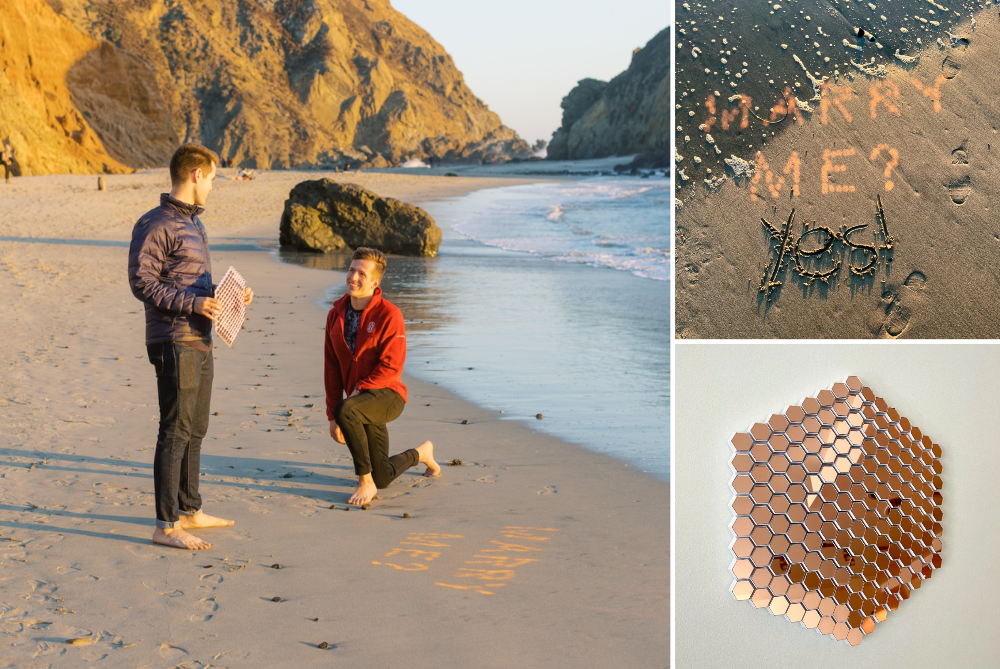

Since I had a lot of fun with this project and because I love open-source code, I figured I'd publish all the source code I wrote to generate the 3D printed model and make a writeup of how I designed this. It is straightforward to modify the code to produce a 3D-printable mirror array to project any arbitrary image onto any focal plane.

## Supplies

- Python 3 and Jupyter with the following libraries installed: `numpy`, `matplotlib`, `numpy-stl`, `hexy`, `vpython`
  - `vpython` is optional if you don't care about rendering the ray tracing visualizations
- A 3D printer
  - I bought a Creality Ender 3 v2 for this project, which I am reasonably happy with, but any FDM printer with a reasonable build volume and ~.1mm accuracy should work fine.
  - Optional: some hair spray or 3D printing adhesive spray (to keep large prints from warping)
- Any decent PLA filament: [[amazon.com/dp/B01EKEMFQS]](https://amazon.com/dp/B01EKEMFQS)
- 1-inch hexagonal mirror tiles: [[amazon.com/dp/B08CSCNT86]](https://amazon.com/dp/B08CSCNT86) or [[amazon.com/dp/B07DF5W7L6]](https://www.amazon.com/dp/B07DF5W7L6/)
- Cyanoacrylate glue: [[amazon.com/dp/B01LYO4R4I]](https://amazon.com/dp/B01LYO4R4I)
  - Most "super glue" is this type. You can use any glue that can bind plastic to glass, but it is important that you use glue that doesn't expand when it cures or it will mess up the very sensitive mirror angles! A very thin coating of cyanoacrylate glue is sufficient to hold the mirrors in place - too much glue can also distort the angles.
- The Sun

## Computing the mirror angles

The basic idea is that we have an array of mirrors forming a hexagonal grid. Each mirror is located with its centroid at some point in space, and we want for it to reflect a ray of sunlight to a pixel at some location on the ground (or any other focal plane). Since we know where each mirror is, where each corresponding target is, and where the sun is, we can solve for how each mirror needs to be oriented in 3D space in order to reflect the sunlight onto its corresponding target.

Consider just a single mirror and a single target pixel. The center of the mirror has  coordinates located at some vector `mirror_pos`, and the center of the target pixel is at `target_pos`. Let's define vectors  such that `mirror_pos` - `target_pos` is the vector pointing from the target to the mirror center, and  is the vector pointing in the direction of the sun (a point source placed at infinity). Here we're assuming the sun is at an inclination of  from the horizon and that the azimuthal angle relative to the mirror is .

Since the reflected angles are the same as the incident angles for a mirror, the normal vector  of the mirror just needs to bisect these two vectors  and , so we have that :

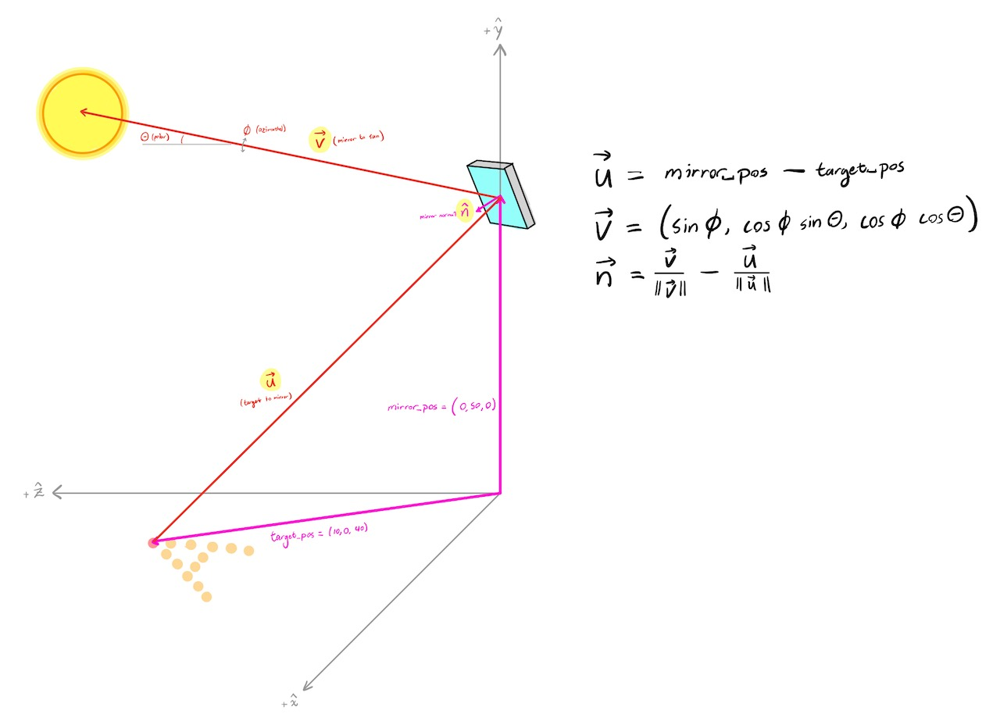

Now that we know how a mirror with a given location and target needs to be angled, let's move on to generating the 3D models for the mirror frame which will hold the mirror at this point in space with this correct orientation.

## Generating a 3D model of a hexagonal prism

A 3D model is just a list of vertices and faces. The vertices are the corners of the polygon (a list of 3D coordinates) and the faces are a list of triangular facets, where each face is specified by tuple containing the indices of three vertices. So to generate the 3D model of the hexagonal prism, I just needed to compute the coordinates for the corners of the prism and define the triangular facets that form the outer faces of the prism.

The 3D printed plastic frame of the mirror array is made up of a grid of hexagonal prisms. Each hexagonal prism has its base on the  plane and has a position  specified by the location of the centroid of the top face (coordinate 7 in the left image), which is normal to the vector . To compute the coordinates for the top corners, I computed the intersection of the plane defined by  and the vector pointing vertically from each corner of the base (right image). I then just used a hard-coded list of vertex indices to specify the faces (so, for example, one face is (0,5,6), while another is (5,12,13) when referring to the left image).

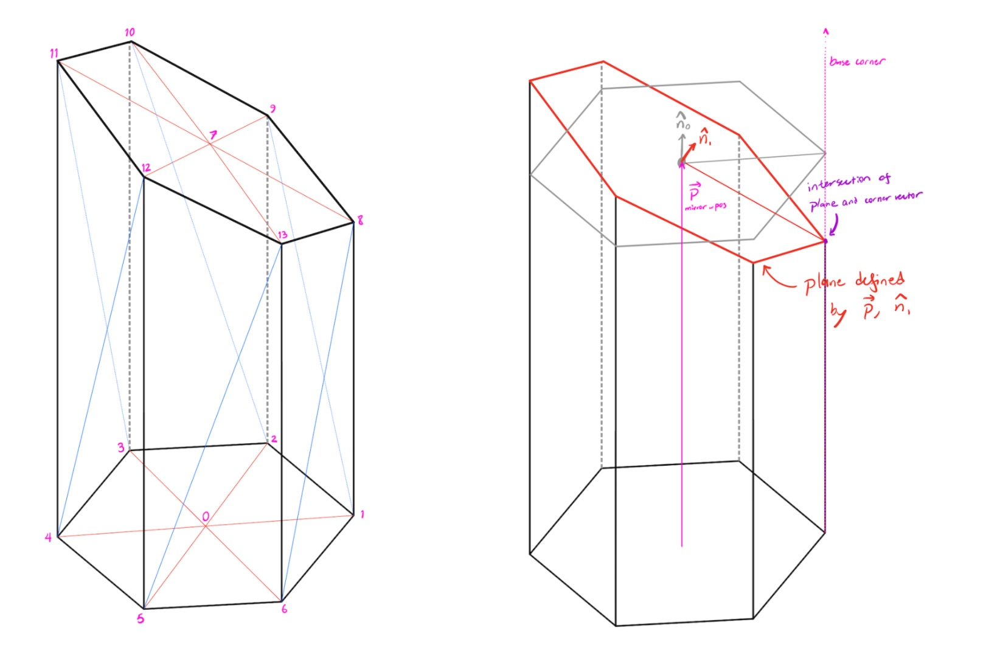

Another thing I included in this function was the ability to add a mirror aligner structure to the prism. This mirror aligner is a small protrusion on two sides of the hex prism which fits on a corner of the hexagonal mirrors, which makes it much less tedious to glue hundreds of mirrors to the final structure (right image below). A subtle detail here is that the coordinates of the mirror aligner are not collinear with the coordinates of the top corners of the hex prism: the mirror aligner always needs to make a  angle, but if the hex prism has a top surface with a steep slope, the corner angles get distorted. So to compute the coordinates of the mirror aligner, I computed the projection of the x axis onto the plane of the the top of the prism as . Then I rotated this vector about the normal vector  by increments of  to get the corners of the aligner.

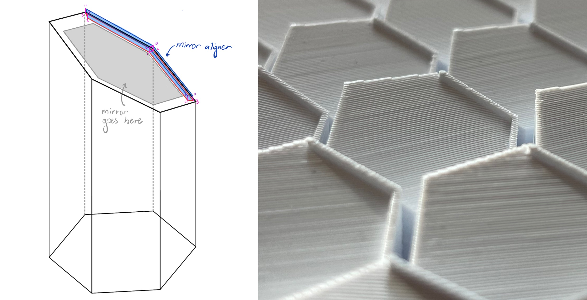

## Generating a hexagonal grid of prisms

Once I had the code to generate the hex prim and the mirror aligner, it is straightforward to generate a grid of these structures, since fusing 3D models can be as simple as concatenating the lists of vertices and faces. This approach does result in some unwanted internal geometry, but most slicer software is smart enough to figure this out and ignore internal geometry when printing.

I generated the hexagonal grid coordinates that define the center of each pillar, then I generated the list of hex prisms with the appropriate orientations to reflect onto a list of target coordinates, and finally I fused the list of prisms together into a single `.stl` file. For aesthetic reasons, I chose to separate the prism by about a 2mm gap and have them joined at the bottom by a slightly wider prism. An example 3D model of a small grid of prisms which all have a common focal point is shown below. The aligner structures are highlighted in red. (Note the difference in angles between the aligner corners and the prism top corners.)

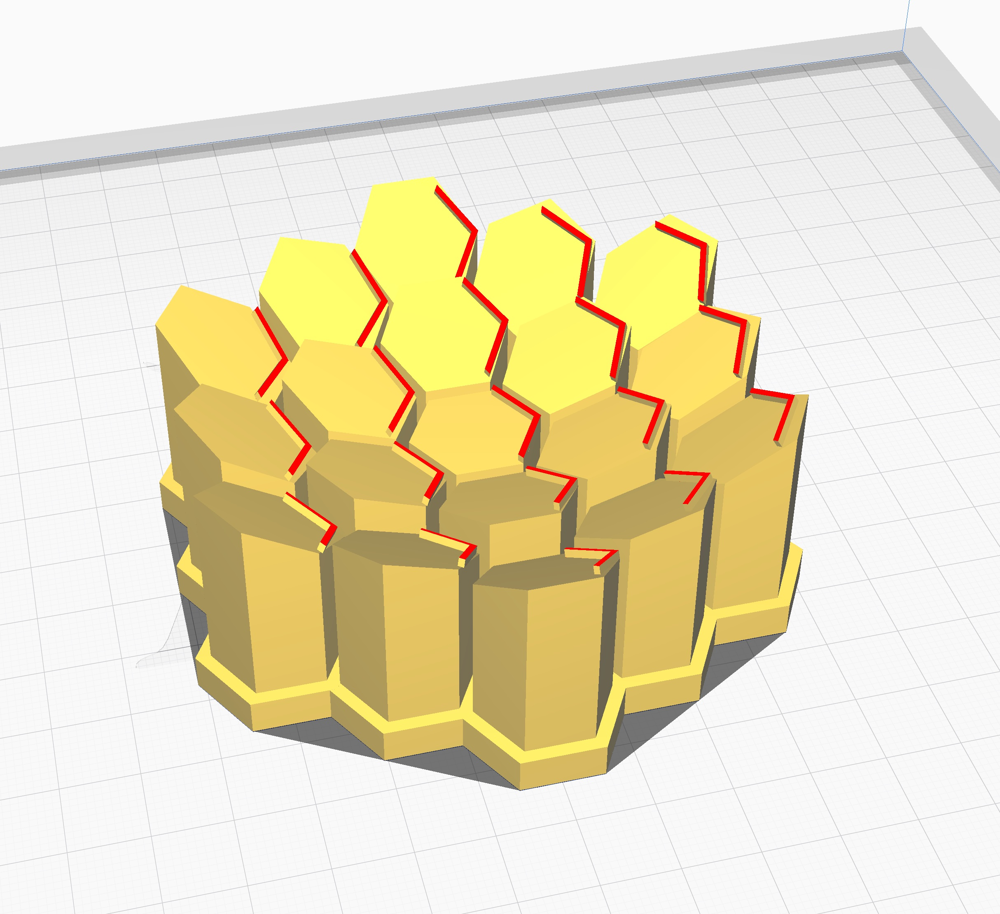

## Optimally matching targets to mirrors

One of the more interesting problems to solve in this project was how to optimally match target light spots to corresponding mirrors to maximize the focal distance tolerance. (So that you can hold the structure at a slightly incorrect distance or orientation from the focal plane and it will still reflect a legible message.)

The mirror array will project a set of rays onto the focal plane to form an image, and when the structure is placed at exactly the right angle and distance from the focal plane, the image will (in theory) be exactly what you want it to be. But if you deviate from this height or angle, the image will slightly deform. However, you can mitigate this by making the rays as parallel as possible, so as to minimize any times where rays will cross each other before the focal plane.

Consider the following scenario in the figure below. There are four mirrors projecting light rays onto four targets which form a diamond formation when placed at the proper focal distance. On the left side, two of the rays will cross each other, while on the right side, the rays are closer to parallel and do not cross. If you move the focal plane relative to the mirror array, the left image will distort, becoming vertically squished, while the right image does not significantly distort (the points remain in the same relative configuration).

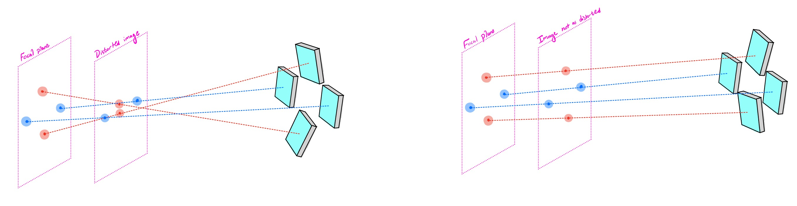

So we want to match the target points with corresponding mirrors so that the rays are as parallel as possible and minimal crossings occur. How should we do this? An early approach I took was to iterate over the mirrors and greedily assign each target to the mirror which minimizes the angle of incidence (so, minimizing the inner product of ). However, this approach didn't work as well as I had hoped because it only considered the magnitude of this inner product rather than the direction of the reflected light beam. You can see some of the distortion in the early test prints of the heart mirrors in the next section, which used this initial matching algorithm. (Although some of that distortion was also due to poor adhesion to the print bed.)

The algorithm I ended up settling on is inspired by the structure of the hexagonal grid itself. A hexagonal grid with radius of  hexagons has a number  of mirrors. So there's one mirror at the center (), and after that, 6 mirrors in the innermost ring (), 12 mirrors in the next ring, then 18, and so on. To minimize ray crossings, I computed the center of mass of the target pixel coordinates, then grouped the coordinates into bins based on their distance from the center of mass, where each bin has a size equal to the number of mirrors in that ring. So the centermost target pixel gets assigned to the center mirror, then the 6 other pixels closest to the center gets assigned to the first ring, and so on. Within each bin, I ordered the target coordinates clockwise starting from the bottom coordinate, and I assigned the target to the mirrors iterated in the same order. So the outermost ring of mirrors corresponds to the outermost ring of targets, and within this set of targets, the bottom target gets assigned to the bottom mirror, the leftmost target gets assigned to the leftmost mirror, etc., as shown in the figure below.

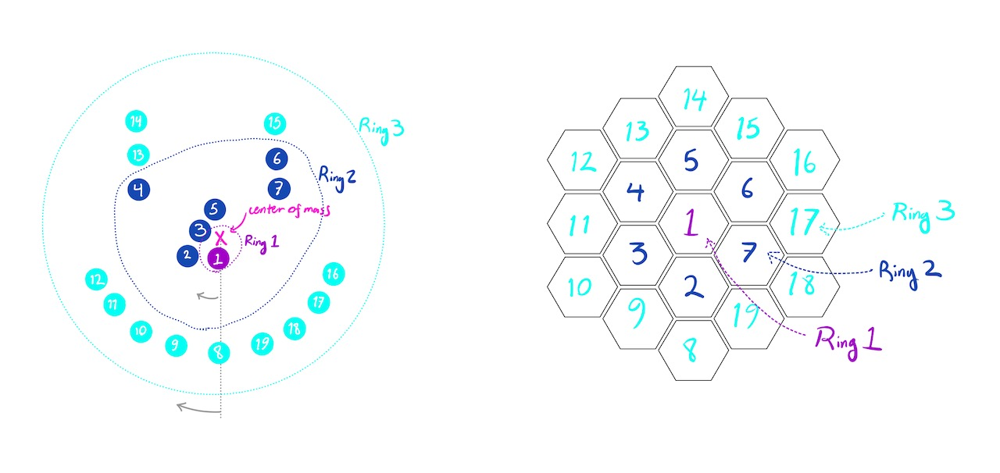

This matching algorithm ended up working quite well. ([And I do love matching algorithms](https://bencbartlett.wordpress.com/2018/03/28/screeps-4-hauling-is-np-hard/)...) Here is a side by side comparison of the rays which form the "MARRY ME?" message when assigned to mirrors randomly (left) versus when assigned using this matching algorithm (right). You can see that the rays are much more parallel. This means that the mirror array can be held within a much wider tolerance of the correct distance from the focal plane while still projecting the message legibly.

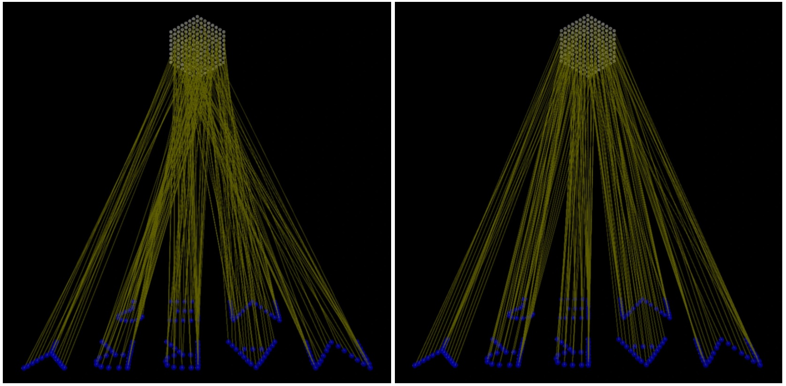

(Also, I discovered the biggest near-failure of this project around the time I was writing the visualization code that I used to generate the images above. At that point, I was about 20 hours into printing the final mirror array frame, and I realized that what I would have printed would actually project the mirror image of what I wanted! "?EM YRRAM" I hadn't caught this issue previously because the test image of the heart was symmetric, so I didn't realize that I was printing the mirror of the correct image. Fortunately I found this mistake in time, since by this point the proposal date was just a week out, so if I had caught this any later I wouldn't have had time to print another frame.  The takeaway from this near-miss is that writing visualization code to help debug what is going on is very important... 🙃)

## Printing the mirror array frame

So by this point I had developed the end-to-end process where you can input a set of coordinates that form your desired image, the location of the focal plane, and the location of the sun, and you get out a .stl model of the mirror array frame that you can 3D print. So now we just need to print this out and glue on the mirrors -- simple, right?

I printed four different attempts at a smaller-scale mirror array to test for the big thing. Each small frame had 37 mirrors and would project the design of a heart. (37 mirrors corresponds to a radius  hex grid, which was the largest I could print out in a single piece given my Ender3's 220mm × 220mm print area.)

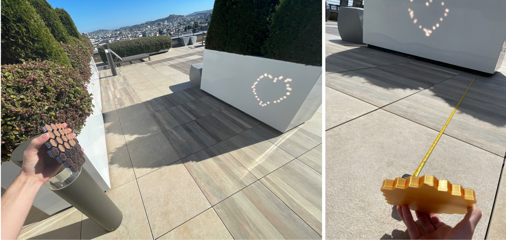

There were two main problems I encountered when printing these test arrays. The first was warping due to the print not fully adhering to the print bed. This would cause the corners at the bottom to slightly peel up due to tension from the cooling layers, which would affect the angles of the hexagonal pillars above the warped base region and distort the projected image. I solved this problem by lowering the bed temperature and applying some hairspray to the print bed (some 3D printing tribal knowledge...), which worked like a charm.

The second problem was how to print out a hex grid which was too big to fit within the print volume. Some slicer programs include built in tools to slice large prints into pieces, but I couldn't use these because the planar cuts would slice through the hexagonal pillars, which would create a ridge on the top face and distort the angles of the mirrors, which need to be accurate to about  (which is a few tenths of a degree). So I created a few custom functions to input a set of pillar models and partition them into smaller printable sub-volumes which could be glue together. This way, the only seams would be at the base of the model, which wouldn't affect the normal vectors of the mirrors.

I played around with a couple of different partitioning schemes, but I settled on using this flower-like pattern shown below, both because I liked the way it looked, and because it provides more structural strength since there is no continuous seam across the entire structure along which the assembled object could snap in half.

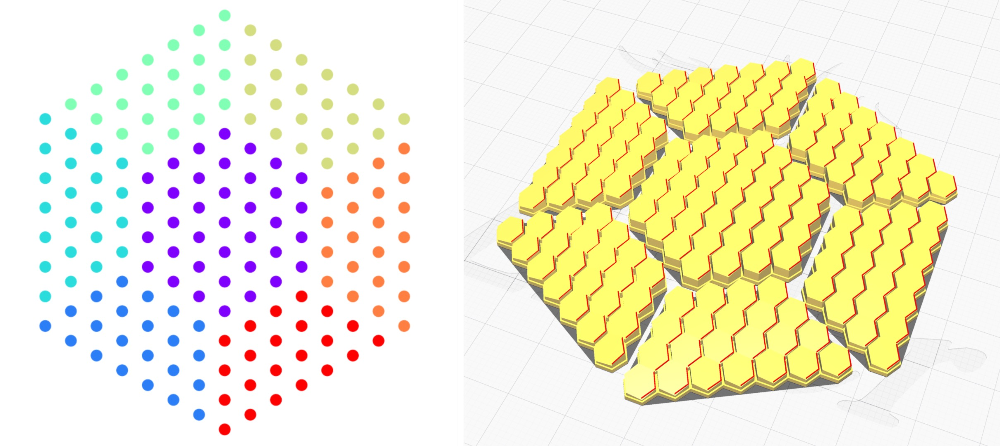

The entire model took about a week to print (I used adaptive layer heights to speed things up a bit when printing the bottom and middle layers, but the top layers needed to be very fine to allow the mirrors to be mounted at exactly the right angles). I assembled the frame and used cyanoacrylate glue to bond each section of the frame at the base. (I had to slightly sand the edges of the final section to get it to fit.) The fully assembled frame is shown below.

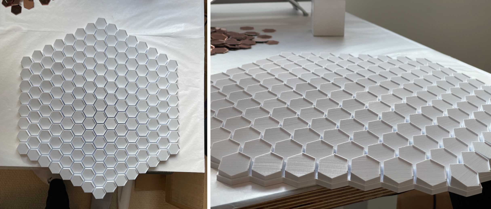

The last step was carefully glueing all 196 mirrors to the completed frame. I found out on some of my earlier test structures that cyanoacrylate glue will produce a lot of vapors when it is curing which can deposit on the mirrors and cause them to look foggy. (They still reflect enough light to work but it looks uglier...) To prevent this, I had a fan running blowing air from right to left while I glued the mirrors, which I attached in a right-to-left, top-to-bottom ordering to minimize vapor exposure.

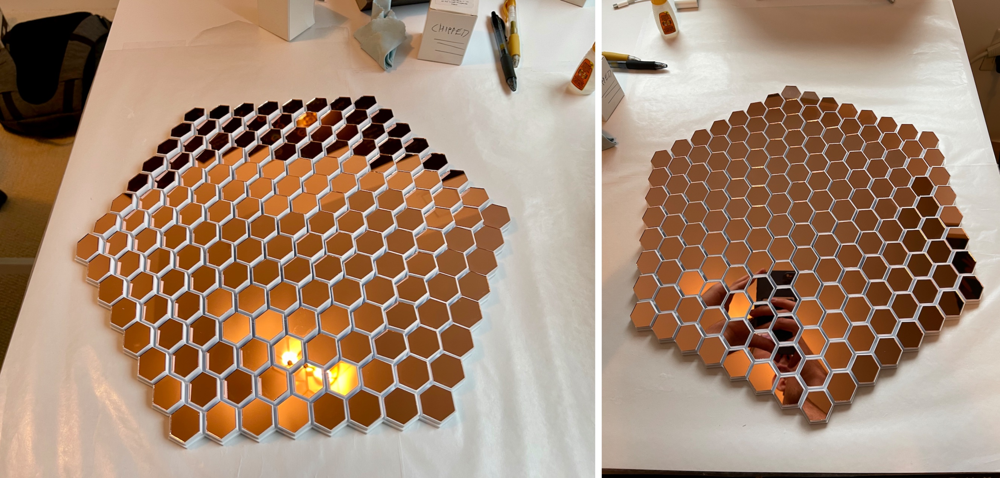

By the time I finished mounting all of the mirrors, it was the night before I was planning to propose, so in a nail-biting twist of fate, I didn't actually get to test the final structure at sunset in advance. Fortunately, it worked exactly as I wanted it to! (And even more fortunately, the temperamental fog of the SF Bay Area decided to take the day off.)

This was the first project I've done with 3D printing (and in fact I got into 3D printing specifically to do this idea), and it felt like magic having a fabricator sitting in my bathroom that could just bring this idea into existence from nothing but a bit of code and some basic principles of physics.

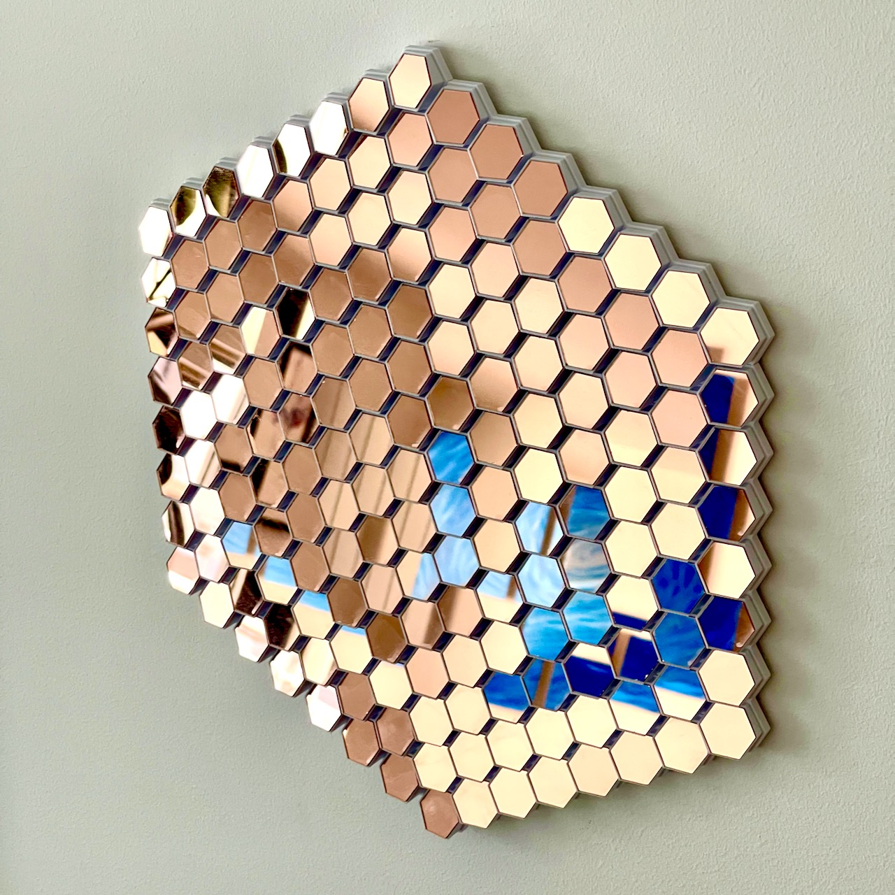

https://user-images.githubusercontent.com/6800253/141389938-2314ee70-1af4-4b23-bdde-341c7c5900be.mp4

